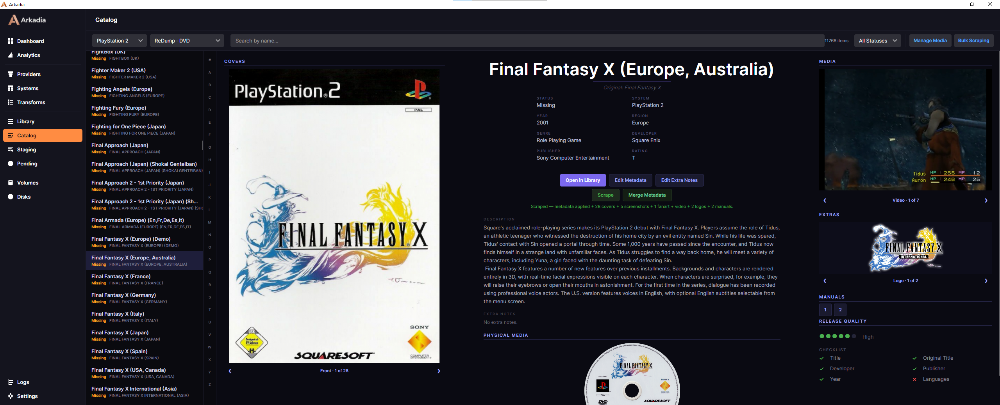
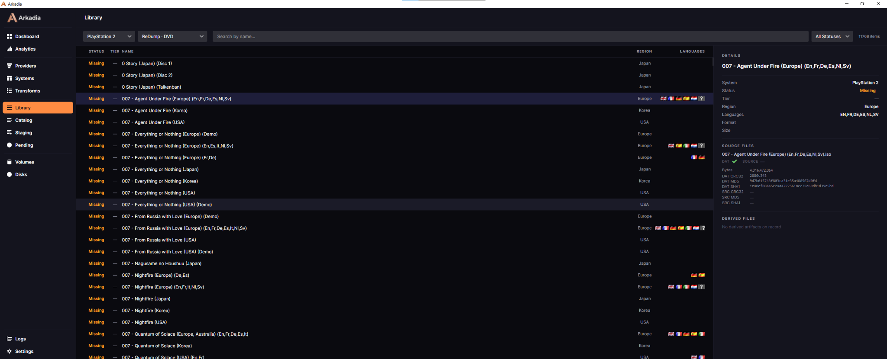
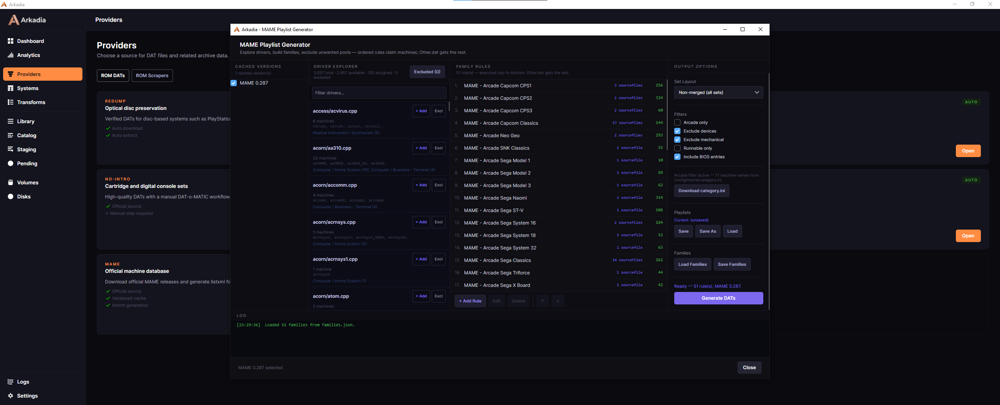
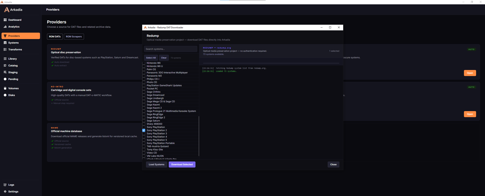
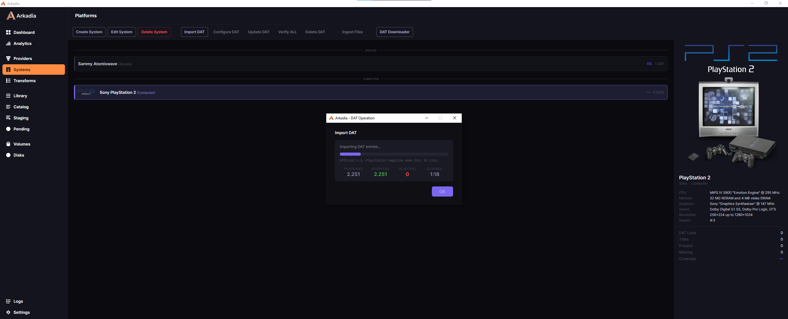
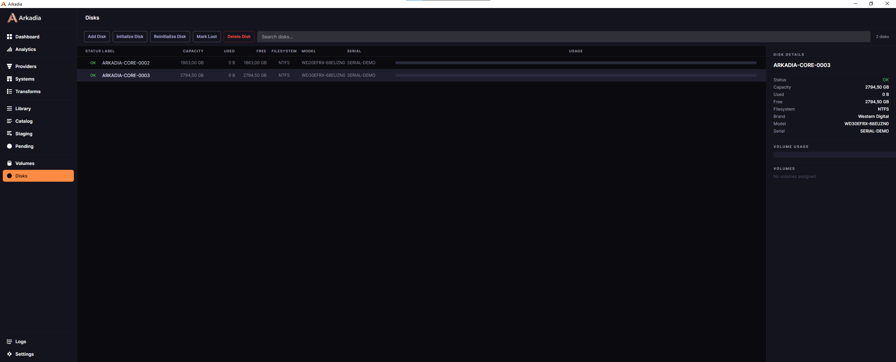

# Arkadia


Arkadia is a preservation-grade desktop application for managing large offline ROM archives across multiple physical disks, with an integrated metadata catalog, offline-first scraping workflow, and coming Arkadia Media Packs.

It provides a structured, integrity-first approach to organizing, verifying, and distributing artifact collections derived from DAT files — ensuring filesystem state and catalog state are always aligned, and that no artifact is ever considered present without independent verification.

---

## Current Project Goal

Arkadia is being developed toward a complete personal preservation workflow tool:

1. Import DAT files from preservation authorities (No-Intro, Redump, TOSEC, MAME, FBNeo, EggmansWorld)
2. Manage a multi-disk physical archive with integrity verification
3. Browse the full collection via a rich Catalog with cover art, screenshots, metadata, and media previews
4. Scrape metadata and media from online scraping providers with a review-before-apply flow
5. Normalize metadata values consistently via configurable mapping rules

---

## High-Level Architecture

```
Arkadia.sln
├── Arkadia.csproj          — Avalonia 11 / .NET 8 desktop app (Windows)
│   ├── DataLayer/          — DatLineStore, CatalogService, VolumePathResolver, normalizers (namespace Arkadia.Data)
│   ├── Library/            — LibraryEntry, title resolution
│   ├── Providers/          — scraping provider clients and import services
│   ├── Ingestion/          — DAT parsing and ingest pipeline
│   ├── Volumes/            — Append, Fillback, Verify Volume, VolumeArtifactPathBuilder
│   ├── LocalArchive/       — Verify Archive, redundancy detection, repair
│   ├── Purge/              — Purge planner/executor, analytics
│   ├── Themes/             — Theme engine, palette management
│   └── MainWindow.axaml    — Single-window UI with view switching
└── Arkadia.Tests.csproj    — xUnit test project (1480 tests)
```

The application is a single-window app with a left nav bar switching between views: Dashboard, Analytics, Providers, Systems, Operations, Catalog, Settings.

---

## Data Layout

At runtime, Arkadia writes all data next to the executable (`AppContext.BaseDirectory`):

```
archive/
  <platform>/
    <datLineId>/                      — active local archive (flat: artifact files at root)

volumes/
  <volume label>/                     — workspace volumes (flat: artifact files at root)

incoming/
  <platform>/                         — files arriving for ingestion

incoming-skip/
  <platform>/                         — suspended/quarantined files (unwanted, unknown, redundant)

data/
  catalog.db                         — global catalog (systems, DAT lines, settings, mappings)
  media/
    <hardwareFamilyId>/
      <datLineId>/
        covers-front/                 — regional front covers
        covers-back/
        covers-spine/
        covers-wrap/
        screenshots-title/            — title screen shots
        screenshots/                  — gameplay screenshots
        fanart/
        videos/
        logos-hd/
        logos/
        marquees/
        flyers/
        manuals/
        physical/                     — physical media photos
        physical-texture/
        metadata/                     — raw provider metadata payloads
  platforms/
    <hardwareFamilyId>/
      <datLineId>/
        releases.db                   — per-DAT SQLite DB (releases, artifacts, proposals, etc.)

incoming-media/                      — manual media intake source folder
scrape-cache/                        — registered provider cache packages
staging-cache/                       — provider cache builder staging

libraries/
  lib-vlc/win-x64/                   — LibVLC runtime (not committed; place manually)

logs/
  ingest/
  volume-verify/
  repair/
  imagecache/
  integrity/

themes/
  visual/default/                    — theme and badge icon assets (committed)

tools/
  7zip/
    7zip.exe                         — 7-Zip console binary (renamed from 7z.exe or 7zz.exe)
    7z.dll                           — 7-Zip library (required when using 7z.exe variant; omit for 7zz standalone)
  chdman/
    chdman.exe                       — MAME chdman tool for CHD compression
  dolphintool/
    DolphinTool.exe                  — Dolphin RVZ compression tool
  wudcompress/
    WudCompress.exe                  — WUD/WUX compression tool
```

---

## Key Concepts

### DAT Providers

A **DAT provider** is an authority that defines release identity and technical catalog data. DAT provider data is canonical technical input — it determines what a release *is* (name, region, format, size, checksum, parent/clone relationships). It is entirely separate from **online scraping providers**, which enrich entries with titles, artwork, and descriptions but do not replace DAT identity.

Supported DAT providers:

| Provider | Typical scope |
|---|---|
| No-Intro | Cartridge-based systems (SNES, GBA, N64, …) |
| Redump | Optical disc systems (PS1, PS2, Saturn, …) |
| TOSEC | Broad multi-platform coverage |
| MAME | Arcade drivers, BIOS sets, devices, software lists |
| FBNeo | Arcade (Final Burn Neo) |
| EggmansWorld | Supplemental/community collections |

### Systems, Hardware Families, and DAT Lines

A **Hardware Family** groups related DAT lines under one catalog context (e.g., all SNES releases, or all MAME arcade entries). A **DAT Line** represents one imported DAT scope under a family — each has its own isolated SQLite database. Display labels are generated at runtime from authority + media type (e.g., `MAME · ROM`, `Redump · DVD`); the raw `dat_lines.name` column stores neutral media-type data, not formatted display text.

Deleting a hardware family is blocked while any DAT lines exist under it.

### Verify DAT vs Verify Archive vs Verify Volume

Three distinct "verify" actions operate at different layers — do not confuse them:

| Action | Layer | What it checks | Touches files? |
|---|---|---|---|
| **Verify DAT** | Policy / configuration metadata | Batch-validates every DAT line's **archive output policy** (form resolution + collision analysis), persisting `archive_output_form` / `validation_state` / fingerprints on `dat_lines`. | **No.** Read-only over releases; never moves/deletes files and never marks releases unwanted. |
| **Verify Archive** | Physical local archive filesystem | Filesystem-first scan of `archive/…`, SHA-1 classification, redundancy detection, and repair (moves to `incoming-skip`). | Yes (moves, never silent delete). |
| **Verify Volume** | Physical volume filesystem | Recursive scan of a volume, SHA-1 classification, recovery moves, flat-layout enforcement, stale-assignment reconciliation. | Yes (moves, never silent delete). |

Verify DAT reports problematic DAT lines (`collision_unresolved`, `stale`, `unknown`/error); resolve them through **Configure DAT** (which runs the collision review — Exclude A/B or Abort). Verify DAT is the button between Configure DAT and Update DAT.

### Systems coverage (wanted-based)

Systems coverage answers *"of the releases I want to keep, how complete is this system?"*, so it excludes the UNWANTED curator veto from its denominator:

- **Wanted Coverage** = present wanted releases / total wanted releases
- **Wanted** = all releases except `status = 'unwanted'`
- **Unwanted Share** = unwanted releases / total releases (reported separately as a curation ratio)

`lost` / MIA-like releases remain **wanted** and are surfaced separately (not folded into coverage or unwanted). A system whose releases are **all** unwanted shows Wanted Coverage as **N/A** (not a misleading `0%`), with Unwanted Share `100%`.

### Catalog

The **Catalog** view is the primary browsing interface. It shows all releases across a selected system and DAT line, with filtering, search, and a detail panel showing:

- Cover gallery (regional covers: front / back / spine / wrap)
- Media gallery (videos, screenshots, fanart)
- Extras (logos, flyers, marquees)
- Manuals (PDF/image files, opened in the system viewer)
- Physical media photos
- Metadata grid (status, system, year, region, genre, developer, publisher, language, rating, players)
- Metadata quality checklist and quality indicator
- Description and Extra Notes

### MAME Provider

MAME DATs describe arcade drivers, BIOS sets, devices, and software lists. Release identifiers are **shortnames** (e.g., `anmlbskt`) — not human-readable titles. When scraping MAME releases, set **Scrape As System** to `arcade` so lookups target the correct external provider system. Because shortnames rarely match title searches, use the **exact ROM fallback** in `ScrapeReviewDialog` to locate the correct game by hash.

Future MAME-specific complementary extraction (driver metadata, parent/clone relationships, working state, technical flags) will be stored separately from provider metadata and will not be overwritten by online metadata providers.

### DAT vs Metadata Provider Separation

| Data | Origin |
|---|---|
| Release identity, shortname | DAT provider |
| Region, format, media type | DAT provider |
| Size, checksum | DAT provider |
| Parent / clone / software-list relationships | DAT provider |
| Technical flags (working state, BIOS, device) | DAT provider |
| Title, original title, description | Online metadata provider |
| Developer, publisher, year, genre | Online metadata provider |
| Rating, players | Online metadata provider |
| Screenshots, video, covers, manuals | Online metadata provider |

DAT-derived facts feed badges, quality indicators, and future filters. They are never overwritten by metadata scraping.

### Online Scraping Providers

Arkadia is designed around a provider-based scraping model. Online providers can be used to build local, sanitized cache packages. Once registered, those packages allow Arkadia to scrape and curate entirely offline. Provider-specific setup and workflow details are documented in the [Cache & Curation Pipeline](docs/CACHE_CURATION_PIPELINE.md).

Provider metadata is always saved as pending proposals first — nothing is applied to the catalog without user review in the Merge Metadata dialog. Canonical metadata and DAT identity are kept strictly separate.

### Manual Scrape Flow

1. **Provider selection** — choose an online scraping provider
2. **ScrapeReviewDialog** — search candidates by title, or accept an exact ROM match; review results before committing
3. **Fetch details** — full metadata and media URLs are retrieved
4. **Import service** — normalizes fields, saves proposals as pending (`accepted=0`), stores raw metadata payload, downloads all media
5. **MergeMetadataDialog** — review each proposed field; fields with existing values show SAME/MANUAL/LOCKED status; user selects which to apply; LOCKED fields cannot be overwritten without explicit override

### Recommended Workflows

**Standard workflow:**
1. Create System and set Scrape As System ID if needed
2. Import DAT file
3. Review Catalog — releases are immediately browsable with DAT-derived identity
4. Scrape metadata — provider proposals are saved as pending
5. Merge metadata — review proposed fields, apply selections
6. Use Edit Metadata for manual corrections or locked-field overrides

**MAME / arcade workflow:**
1. Import MAME-derived DAT — shortnames become release identifiers
2. Set Scrape As System = `arcade`
3. For each release, use ScrapeReviewDialog with exact ROM fallback (shortnames don't match title search)
4. Future complementary extraction will enrich working state, driver metadata, and parent/clone trees without touching metadata proposals

### Edit Metadata

Manual metadata entry for any release. Each field has a lock checkbox. Controlled-vocabulary fields (genre, release_type, region, etc.) are normalized via the metadata value mapping rules before saving.

### Metadata Field Locks

Each metadata field can be **locked** per release. Locked fields are skipped when proposals are auto-applied (during bulk scrape) and show a LOCKED badge in the Merge Metadata dialog. Locks can be toggled per-field in both Edit Metadata and Merge Metadata.

### Metadata Value Mappings

A global table of normalization rules (`field`, `match_value`, `replacement`, `enabled`). Rules are seeded with defaults (e.g., `region/wor → World`, `release_type/fantranslation → Fan Translation`) and can be managed in **Settings → Metadata Value Mappings**. Applied at proposal-save time, manual-edit time, and badge display.

### Media Filesystem Layout

Media files use indexed stems: `<releaseStem>_<index>.<ext>` (screenshots, fanart, logos, etc.) or `<releaseStem>_<region>_<index>.<ext>` (regional covers). The provider import service deduplicates by expected byte size before downloading.

### Arkadia Media Pack (AMP)

**AMP** (`.amp`) is the planned Arkadia-native curated package format: provider-agnostic, suitable for offline reuse and distribution where legally permissible. AMP packages carry accepted media, canonical metadata, credits, Extra Notes, preferred state, and exclusion hashes — but no raw provider payloads and no visible provider provenance.

**ARK** (`.ark`) is the Arkadia Backup / Archive format (v0.5 implemented) for database and application state backup/restore. It is not a media pack.

ARK backups are created via the **Backups** sidebar section. Packages are written to `backups\` in the application folder alongside a `.ark.sha256` integrity sidecar. The log shows creation progress and automatic verification. Live restore while the application is running is intentionally blocked — a restart-safe restore workflow is planned.

> **AMP is not a backup. ARK is not a media pack.**

AMP v1 specification: [docs/SPECS/ARKADIA_MEDIA_PACK_V1_SPEC.md](docs/SPECS/ARKADIA_MEDIA_PACK_V1_SPEC.md)

### External Tools

Arkadia uses bundled external tools for compression and archive extraction. Tools are **not committed** to the repository. Place them next to the executable before using the features that require them.

**Naming convention:** `tools\<toolname>\<toolname>.exe`

| Tool ID | Path | Source | Used for |
|---|---|---|---|
| `7zip` | `tools\7zip\7zip.exe` | 7-Zip ([7-zip.org](https://7-zip.org)) | MAME SFX extraction; .7z and .rar ingest |
| `chdman` | `tools\chdman\chdman.exe` | MAME Tools | CHD compression (CD, DVD, GD, PSP, Dreamcast) |
| `dolphintool` | `tools\dolphintool\DolphinTool.exe` | Dolphin Emulator | RVZ compression |
| `wudcompress` | `tools\wudcompress\WudCompress.exe` | WudCompress | WUX compression |

**7-Zip setup:** 7-Zip is distributed as either a split package (`7z.exe` + `7z.dll`) or a standalone binary (`7zz.exe`). Both can be placed in `tools\7zip\` after renaming the primary executable to `7zip.exe`. Renaming is safe — `7z.dll` is loaded by its own hardcoded name and does not depend on the executable filename.

- Split package: place `7zip.exe` (renamed from `7z.exe`) and `7z.dll` in `tools\7zip\`
- Standalone: place `7zip.exe` (renamed from `7zz.exe`) in `tools\7zip\` — no DLL needed

If 7zip is not present, MAME provider extraction is blocked and .7z/.rar ingest archives are skipped with a log message. ZIP archives work without 7zip.

**chdman** follows the `tools\<toolname>\<toolname>.exe` convention exactly.

**dolphintool and wudcompress** use upstream executable names (`DolphinTool.exe`, `WudCompress.exe`) that differ from the folder name casing. These will be normalized in a future migration.

### LibVLC

Video previews in the Catalog gallery require LibVLC. Place the `libvlc.dll` and related files in `libraries/lib-vlc/win-x64/` next to the executable. If absent, videos fall back to a text label with a play overlay.

---

## Building

```bash
git clone https://github.com/your-org/arkadia.git
cd arkadia
dotnet build Arkadia.sln -c Release
dotnet test Arkadia.sln -c Release    # 1480 tests — all must pass
dotnet run --project Arkadia/Arkadia.csproj
```

**Requirements:** .NET 8 SDK, Windows 10+.

---

## Publishing (Portable win-x64 single file)

```bash
dotnet publish Arkadia/Arkadia.csproj /p:PublishProfile=win-x64-portable
```

Output lands in `publish\win-x64\`. Copy `libraries/lib-vlc/win-x64/` alongside the executable for video playback support.

---

## Current Major Features

| Area | Status |
|---|---|
| DAT import (No-Intro, Redump, TOSEC, MAME, FBNeo, EggmansWorld) | Stable |
| SHA-1 integrity verification | Stable |
| Local archive management (ingest, verify, repair) | Stable |
| Uniform per-DAT-line archive output form (SingleFileFlat / MultiFileReleaseFolder) | Stable |
| Release-name-based archive naming + `ArchiveArtifactPathBuilder` write authority | Stable |
| Archive collision review (Exclude A/B / Abort) + non-interactive ingestion gate + runtime no-overwrite guard | Stable |
| Verify DAT — batch archive-output policy validation (metadata only; no file I/O) | Stable |
| Verify Archive — filesystem-first scan + classify + repair | Stable |
| Verify Archive — redundant copy detection (volume re-verify before move) | Stable |
| Append Volume — fill volume from archive with diagnostics | Stable |
| Fillback Volume — move content between volumes | Stable |
| Verify Volume — recursive scan + recovery + flat layout enforcement + missing-assignment reconciliation | Stable |
| UNWANTED curator veto (SQL-guarded; only RestoreWantedRelease exits) | Stable |
| Purge workflow (planner, executor, analytics) | Stable |
| Catalog browse with cover/media gallery | Stable |
| Manual scrape with review-before-apply | Stable |
| Offline scraping from registered cache packages | Stable |
| Bulk scraping from registered cache packages | Stable |
| Online provider cache builder | Stable |
| Metadata proposals + Merge dialog | Stable |
| Edit Metadata with field locks | Stable |
| Metadata value mappings (Settings) | Stable |
| Media curation (Manage Media workbench) | Stable |
| Extra Notes per release | Stable |
| Theme engine with palette support | Stable |
| LibVLC video preview | Stable |
| Arkadia Media Pack (.amp) export | Stable |
| Arkadia Backup / Archive (.ark) — backup creation UI | Stable (v0.5); live restore blocked pending restart-safe flow |
| Additional online providers | Planned |

---

## Screenshots

### Curated Catalog



*Curated release view with canonical metadata, covers, video, logos, manuals, physical media, and quality checks.*

### Preservation Library



*DAT-backed release inventory with regions, languages, source files, hashes, and preservation status.*

### Provider Workflows

<table>
<tr>
<td width="50%">



**MAME DAT Generator** — Prepare versioned MAME data with driver exploration, family rules, filters, and DAT generation.

</td>
<td width="50%">



**Redump DAT Downloader** — Download system DATs from supported preservation sources and track acquisition logs.

</td>
</tr>
</table>

### Systems and Storage

<table>
<tr>
<td width="50%">



**Systems and DAT Import** — Manage platforms, inspect hardware details, and import DAT lines with progress tracking.

</td>
<td width="50%">



**Disks** — Register and monitor archive disks with capacity, filesystem, usage, and volume assignment details.

</td>
</tr>
</table>

---

## Documentation

- [User Manual](docs/USER_MANUAL.md)
- [Developer Notes](docs/DEVELOPER_NOTES.md)
- [Archive and Volume Model](docs/ARCHIVE_AND_VOLUME_MODEL.md) — archive vs volume architecture, incoming-skip, flat layout, data integrity rules
- [UNWANTED Releases](docs/UNWANTED_RELEASES.md) — curator veto semantics, SQL guard, RestoreWantedRelease
- [Verify Archive](docs/VERIFY_ARCHIVE.md) — filesystem-first scan, classifications, redundancy detection, repair behaviour
- [Volume Workflows](docs/VOLUME_WORKFLOWS.md) — Append Volume, Fillback Volume, Verify Volume
- [Ingestion Pipeline](docs/INGESTION_PIPELINE.md) — ingest phases, unwanted early-skip, incoming-skip
- [Volume & Archive QA Checklist](docs/QA_CHECKLIST.md) — manual QA steps for volume/archive workflows
- [Cache & Curation Pipeline](docs/CACHE_CURATION_PIPELINE.md) — provider cache builder, staging, registered cache manager, verify package, offline / bulk scraping, Manage Media workbench, Extra Notes, AMP direction
- [AMP v1 Specification](docs/SPECS/ARKADIA_MEDIA_PACK_V1_SPEC.md) — Arkadia Media Pack format specification
- [ARK v0.5 Specification](docs/SPECS/ARKADIA_BACKUP_ARCHIVE_V0_5_SPEC.md) — Arkadia Backup / Archive format specification
- [Roadmap](docs/ROADMAP.md)

---

## License

MIT License. See [LICENSE](LICENSE) for details.
